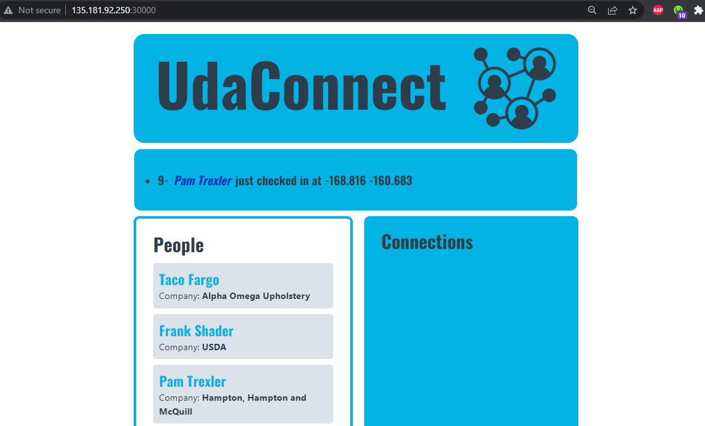

## HOW TO RUN
### With argocd installed
- #### run ./createapp.sh
- #### this should deploy all the resources in the default namespace
- #### seed the database
- #### frontend port 30001
- #### api port 30001
- #### locations api port 30004
- #### webscocket notification server port 30005

## Sample app can be acceseed at http://135.181.92.250:30000/

 

