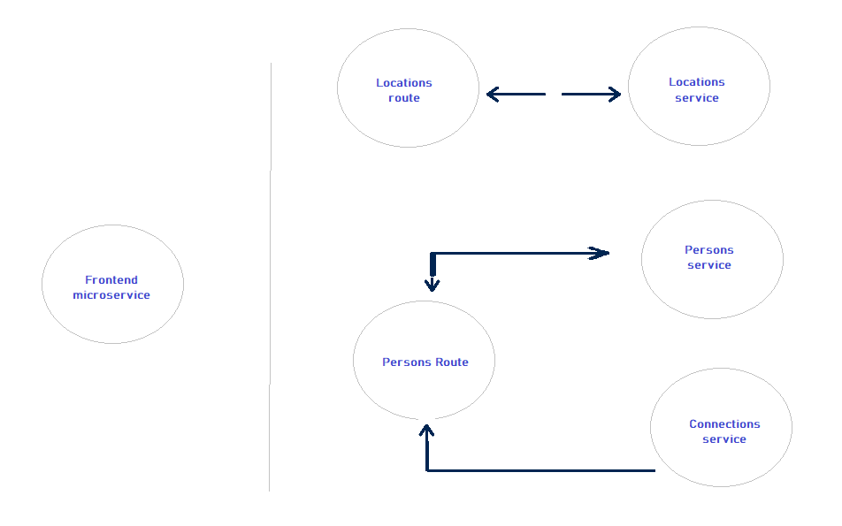
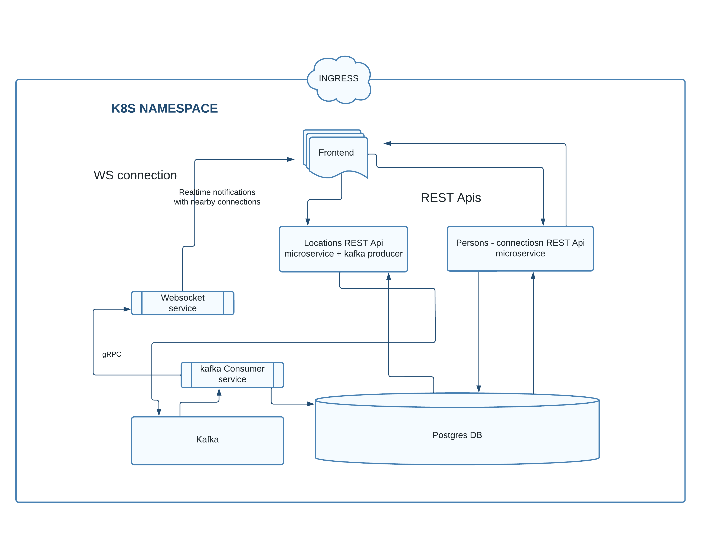

# Analysis:
## What to refactor with strangler pattern

- ### Location route and location service are more decoupled from the rest of the application

- ### Further the location route will be refactored to accomodate message queueing to Kafka logs aggregator later on

### This is a good candidate for refactoring
 

  
# Messaging passing strategies used
- ### For the front-end facing routes REST APIs are used
- ### Websocket microservice is added to notify the connected users with potential realtime connections
- ### Message queueing with Kafka logs aggregator is implemented to receive the <b>posted locations</b> from the loations rest endpoit (Kafka producer) and mediates the events to the locations service which will persist the data and notify the websocker microservice
- ### gRPC prtocol is used to carry the messages from the Kafka consumer in the locations microservice to the websocket microservice
 

  